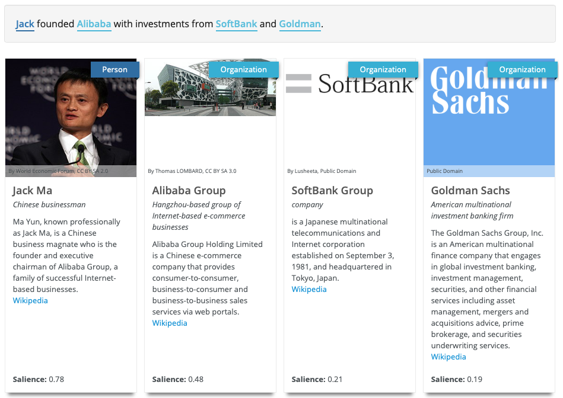

Try the [demo](http://ambiversenlu.mpi-inf.mpg.de) at http://ambiversenlu.mpi-inf.mpg.de

# Ambiverse Natural Language Understanding - AmbiverseNLU

The multilingual Ambiverse Natural Language Understanding suite (AmbiverseNLU) combines a
number of state-of-the-art components for language understanding tasks: named
entity recognition and disambiguation (or entity linking), open information
extraction, entity salience estimation, and concept linking, providing a basis
for text-to-knowledge applications.

Take the example sentence below:

```
Jack founded Alibaba with investments from SoftBank and Goldman.
```

The AmbiverseNLU will produce the following outputs:

[](http://ambiversenlu.mpi-inf.mpg.de)

## AmbiverseNLU Demo

Quickly play with AmbiverseNLU without installing anything: [demo](http://ambiversenlu.mpi-inf.mpg.de) at http://ambiversenlu.mpi-inf.mpg.de

## Quick Start

### Call the Web Service using Docker

Starting the AmbiverseNLU as web service (with PostgreSQL backend) using Docker is simple, using docker-compose:

~~~~~~~~~~~~
docker-compose -f docker-compose/service-postgres.yml up
~~~~~~~~~~~~

If your machine has less than 32 GB of main memory, run this configuration instead, which knows way fewer entities (some big companies and related entities )but is good enough to play around:

~~~~~~~~~~~~
docker-compose -f docker-compose/service-postgres-small.yml up
~~~~~~~~~~~~

Wait for some time (depending on your internet connection and CPU speed it can easily take more than an hour), then call the service:

~~~~~~~~~~~~
curl --request POST \
  --url http://localhost:8080/factextraction/analyze \
  --header 'accept: application/json' \
  --header 'content-type: application/json' \
  --data '{"docId": "doc1", "text": "Jack founded Alibaba with investments from SoftBank and Goldman.", "extractConcepts": "true" }'
~~~~~~~~~~~~

You can run AmbiverseNLU with different databases as backend, or also start the database backend alone. Check out the different configurations of the Docker files on https://github.com/ambiverse-nlu/dockerfiles for details.

## Alternative Ways to Run

### Start the Database Backend

Start the PostgreSQL backend with the fully multilingual knowledge graph:
~~~~~~~~~~~~
docker run -d --name nlu-db-postgres \
  -p 5432:5432 \
  -e POSTGRES_DB=aida_20180120_cs_de_en_es_ru_zh_v18_db \
  -e POSTGRES_USER=ambiversenlu \
  -e POSTGRES_PASSWORD=ambiversenlu \
  ambiverse/nlu-db-postgres
~~~~~~~~~~~~

If you have less than 32 GB of main memory, you can also start a PostgreSQL backend with a smaller knowledge graph, containing only a few companies and related entities, supporting only English and German:
~~~~~~~~~~~~
docker run -d --name nlu-db-postgres \
  -p 5432:5432 \
  -e POSTGRES_DB=aida_20180120_b3_de_en_v18_db \
  -e POSTGRES_USER=ambiversenlu \
  -e POSTGRES_PASSWORD=ambiversenlu \
  ambiverse/nlu-db-postgres
~~~~~~~~~~~~

Make sure to use `aida_20180120_b3_de_en_v18_db` as value for the `AIDA_CONF` exports below.

### Start the Web Service using Maven and Jetty from Source Code

1. Adapt the database configuration. You need to adapt the `database_aida.properties` of the `AIDA_CONF` you are using. For example, if you are using `aida_20180120_cs_de_en_es_ru_zh_v18_db` as configuration, adapt `src/main/config/aida_20180120_cs_de_en_es_ru_zh_v18_db/database_aida.properties` and make sure that the property `dataSource.serverName` points to the host of the machine (or linked docker image) that runs the database.  
2. Start the web service by executing the following script:

~~~~~~~~~~~~
export AIDA_CONF=aida_20180120_cs_de_en_es_ru_zh_v18_db
./scripts/start_webservice.sh
~~~~~~~~~~~~

You can the `MAVEN_OPTS` in the script if you want to change the port and the available memory. 
If you adapt `AIDA_CONF`, make sure that PostgreSQL backend started above uses the same configuration value. The `database_aida.properties` configuration must point to an existing database.

### Run a Pipeline from the Command Line

Adapt the database configuration as explained in the section above (Starting the Web Service).

The main command line interface is `de.mpg.mpi_inf.ambiversenlu.nlu.entitylinking.run.UimaCommandLineProcessor`. Example call using a script: 

```
export AIDA_CONF=aida_20180120_cs_de_en_es_ru_zh_v18_db
mkdir nlu-input
echo "Jack founded Alibaba with investments from SoftBank and Goldman." > nlu-input/doc.txt
./scripts/driver/run_pipeline.sh -d nlu-input -i TEXT -l en -pip ENTITY_SALIENCE
```

A list of existing pipelines can be found in `de.mpg.mpi_inf.ambiversenlu.nlu.entitylinking.uima.pipelines.PipelineType`, where you can also define new pipelines.

## Database dumps 
The database dumps can be downloaded from http://ambiversenlu-download.mpi-inf.mpg.de/. The database docker images will download them automatically.

## Natural Language Understanding Components

### KnowNER: Named Entity Recognition 

Named Entity Recognition (NER) identifies mentions of named entities (persons,
organizations, locations, songs, products, ...) in text.

KnowNER works on English, Czech, German, Spanish, and Russian texts.

AmbiverseNLU provides KnowNER [1] for NER.

### AIDA: Named Entity Disambiguation

Named Entity Disambiguation (NED) links mentions recognized by NER (see above) 
to a unique identifier. Most names are ambiguous, especially family names,
and entity disambiguation resolves this ambiguity. Together with NER, NED is
often referred to as entity linking.

AIDA works on English, Chinese, Czech, German, Spanish, and Russian texts.

AmbiverseNLU provides an enhanced version of AIDA [2] for NED,
mapping mentions to entities registered in the Wikipedia-derived YAGO [4,5] knowledge base.

### ClausIE: Open Information Extraction

Open Information Extraction (OpenIE) is the task of generating a structured output from 
natural language text in the form of n-ary propositions, consisting of a subject, 
a relation, and one or more arguments. For example, in the sentence "Albert Einstein 
was born in Ulm", an open information extraction system will generate the extraction 
("Albert Einstein", "was born in", "Ulm"), where the first argument is usually 
referred as the subject, the second as the relation, and the last one as the object 
or argument.

ClausIE works on English texts.

AmbiverseNLU provides an enhanced version of ClausIE [3] for OpenIE.

### Concept Linking

Concept linking is similar to entity linking but with a focus on non-named entities 
(e.g., car, chair, etc.). It identifies relevant concepts in text and links them to a 
to concepts registered in the Wikipedia-derived YAGO [4,5] knowledge base.

Concept Linking works on English, Chinese, Czech, German, Spanish, and Russian texts.

AmbiverseNLU provides a new concept linking component based on the original AIDA 
entity disambiguation with knowledge-informed spotting.

### Entity Salience

Entity Salience gives each entity in a document a score in [0,1], denoting its 
importance with respect to the document.

Our Entity Salience is fully multilingual. 

## Resource Considerations

### Main Memory

The Entity/Concept Linking component has the largest main memory requirements. This
is due to the large contextual and coherence models it needs to load in order to disambiguate
with high accuracy.

Initially, Entity Linking loads static data in main memory, which requires (depending on the
languages you are configuring it for), a couple of GB. We estimate 8 GB for all languages to 
be the upper bound.

The actual requirements per document vary depending on the density of mentions and the
number of entites per mention, so it cannot be estimated just by the length of the document.
To be on the safe side, plan 8 GB of main memory per document.

This means that if you want to disambiguate one document at a time, you need at least 16 GB
of main memory. If you want to disambiguate 4 documents in parallel, you should be using
40 GB.

### Throughput Analysis

Benchmarking setup: (multi-threaded) Entity Linking Service in a single Docker-container using 4 cores and 32 GB of main memory.
Cassandra node running on the same physical machine.

For 1,000 news articles (2,531 chars on average, 26 named entities on average), with highest-quality setting (coherence):
* Average time per article: 2.36 seconds
* Throughput: 1.7 documents per second

## Evaluation

The Entity Disambiguation accuracy on the widely used CoNLL-YAGO dataset [2] is as follows:
* Micro-Accuracy: 84.61%
* Macro-Accuracy: 82.67%

## Advanced configuration

### Configuring the environment

Most settings are bundled by folder in 'src/main/config'. Set the configuration
you need using the AIDA_CONF environment variable, e.g.:

```
export AIDA_CONF=aida_20180120_cs_de_en_es_ru_zh_v18_db
```

### AmbiverseNLU Pipeline

AmbiverseNLU has a flexible, based on UIMA and DKPro, which allows you to
specify the components you want to run. A number of useful pipelines are
preconfigured, new ones can be added easily.

#### Using pipelines programaticaly 

##### In the web service:

Have a look at `de.mpg.mpi_inf.ambiversenlu.nlu.entitylinking.service.web.resource.impl.AnalyzeResourceImpl.java` which configures the web service.

##### As a stand alone application 

Have a look at `de.mpg.mpi_inf.ambiversenlu.nlu.drivers.test.Disambiguation` and `de.mpg.mpi_inf.ambiversenlu.nlu.drivers.test.OpenIE` for examples.

#### Creating new pipelines

Pipelines are enums in `de.mpg.mpi_inf.ambiversenlu.nlu.entitylinking.uima.pipelines.PipelineType`. Each pipeline contains the order in which the 
components should be executed. The components are located in `de.mpg.mpi_inf.ambiversenlu.nlu.entitylinking.uima.components.Component`.

### Building your own YAGO Knowledge Graph

AmbiverseNLU uses the YAGO knowledge base by default.

Building steps:

1. Create the YAGO KG and AIDA repositories using `scripts/repository_creation/createAidaRepository.py`
2. Build updated KnowNER models (optional), again using `scripts/repository_creation/createAidaRepository.py` passing `--reuse-yago --stages KNOWNER_PREPARE_RESOURCES,KNOWNER_TRAIN_MODEL` as additional parameters

### Building a custom Knowledge Graph

The AmbiverseNLU architecture is knowledge base agnostic, allowing your to import your own concepts and entities, or combine them with YAGO. Have a look at `de.mpg.mpi_inf.ambiversenlu.nlu.entitylinking.datapreparation.PrepareData` and `de.mpg.mpi_inf.ambiversenlu.nlu.entitylinking.datapreparation.conf.GenericPrepConf` to get started.

### Extending KnowNER

KnowNER provides means to add new languages. Have a look at `docs/know-ner/new_corpus.md` and `docs/know-ner/new_language.md`.

## Further Information

* AmbiverseNLU project website: [http://www.mpi-inf.mpg.de/ambiverse-nlu/](http://www.mpi-inf.mpg.de/ambiverse-nlu/)
* [Build Status](https://travis-ci.org/ambiverse-nlu/ambiverse-nlu): 

## Stay in Touch

Sign up for the AmbiverseNLU mailing list: Visit https://lists.mpi-inf.mpg.de/listinfo/ambiversenlu or send a mail to ambiversenlu-subscribe@lists.mpi-inf.mpg.de

## AmbiverseNLU License

[Apache License, Version 2.0](https://www.apache.org/licenses/LICENSE-2.0.html)

## Maintainers and Contributors

Current Maintainers (in alphabetical order):

* Dragan Milchevski
* Ghazale Haratinezhad Torbati
* Johannes Hoffart
* Luciano Del Corro

Contributors (in alphabetical order):

* Artem Boldyrev
* Daniel Bär
* Dat Ba Nguyen
* Diego Ceccarelli 
* Dominic Seyler
* Dragan Milchevski
* Felix Keller
* Ghazale Haratinezhad Torbati
* Ilaria Bordino
* Johannes Hoffart
* Luciano Del Corro
* Mohamed Amir Yosef
* Tatiana Dembelova
* Vasanth Venkatraman

## References

* [1] D. Seyler, T. Dembelova, L. Del Corro, J. Hoffart, and G. Weikum, “A Study of the Importance of External Knowledge in the Named Entity Recognition Task,” Proceedings of the 56th Annual Meeting of the Association for Computational Linguistics, ACL 2018, Melbourne, Australia, 2018
* [2] J. Hoffart, M. A. Yosef, I. Bordino, H. Fürstenau, M. Pinkal, M. Spaniol, B. Taneva, S. Thater, and G. Weikum, “Robust Disambiguation of Named Entities in Text,” Proceedings of the 2011 Conference on Empirical Methods in Natural Language Processing, EMNLP 2011, Edinburgh, Scotland, 2011
* [3] L. Del Corro and R. Gemulla, “ClausIE - clause-based open information extraction.,” Proceedings of the 22nd International Conference on World Wide Web, WWW 2013, Rio de Janerio, Brazil, 2013
* [4] T. Rebele, F. M. Suchanek, J. Hoffart, J. Biega, E. Kuzey, and G. Weikum, “YAGO - A Multilingual Knowledge Base from Wikipedia, Wordnet, and Geonames.,” Proceedings of the 15th International Semantic Web Conference, ISWC 2016, Kobe, Japan, 2016
* [5] J. Hoffart, F. M. Suchanek, K. Berberich, and G. Weikum, “YAGO2: A spatially and temporally enhanced knowledge base from Wikipedia,” Artificial Intelligence, vol. 194, pp. 28–61, 2013
